# 智慧型傷口分級與照護對應系統：完整進度與問題處理報告

資料截止：2026-09-29（Asia/Taipei）
用途：教授進度報告、畢業專題佐證、履歷作品說明
Repository：[wangj6231/woundcare-system](https://github.com/wangj6231/woundcare-system)

> 醫療影像提醒：第十一節包含公開 FUSeg 足部傷口影像。這些圖片是開發驗證錯誤分析，不是本研究場域病人、不是分類48張鎖定測試，也不是臨床診斷建議。

## 一、目前結論

本專案已建立「傷口定位／分割 → 七類分類 → 護理師覆核 → 經覆核建議進入可追溯知識庫」的研究原型。分類結果已完成保存資料重建；分割模型完成多輪受控比較；App具備人工覆核、角色權限、病人切換保護與RAG來源追溯。

但目前不能說模型已達臨床落地：最新分割候選仍未通過預先固定的 development gate，七類分類資料來源仍缺完整上游授權證據，也沒有新的獨立七類外部驗證。研究價值在於已找到並量化多個真實問題，而不是只保留最高分：

1. 歷史分類統計把3,622列當成有效預測；重新從25個保存檔核對後，正確是5 seeds × 720＝3,600列。
2. 歷史ISIC→FUSeg驗收把RGB NumPy直接傳給要求BGR NumPy的推論介面，使F1只剩20.06%；修正唯一色彩契約後為86.01%。
3. 修正後仍有Precision與裁切完整率未過門檻，問題集中於小傷口、多傷口影像與錯誤框。
4. 小傷口加權抽樣在seed42看似成功，但五seed確認只有2/5通過完整門檻，因此不能宣稱穩定改善。
5. 將訓練尺度由768提高到1024，在單一配對實驗沒有增加總TP；very-small TP反而26→25，FP由30→35。
6. F1.3配對錯誤稽核顯示，兩模型都是203 TP，但各有8個彼此不同的獨有TP；主要新增問題是`OTHER_REGION_FP`由9→14，不是單純「解析度越高越好」。
7. 已找到18張來源原生全零mask的FUSeg訓練負樣本，但它們原本每epoch已各出現一次，不可包裝成新資料或新監督。

## 二、目前完成度：程序完成不等於模型通過

以下完成度只表示該階段預先定義的產物是否完成，不表示研究假說成功或可部署。

| 工作包 | 程序完成度 | 效能／科學結論 | 目前狀態 |
|---|---:|---|---|
| 分類結果修正 A5／B1 | 100% | 3,600保存列完整重建；歷史row-wise CI不再作嚴格推論 | COMPLETE |
| 分類grouped CI B2 | 0% | 缺歷史row→image／MD5 group身分，禁止猜測 | BLOCKED |
| RGB/BGR受控重評估 C | 100% | F1 86.01%，但Precision與crop門檻未全過 | COMPLETE / GATE FAIL |
| 小傷口抽樣 D1 | 100% | seed42通過研究前進門檻 | COMPLETE / SINGLE-SEED PASS |
| 小傷口抽樣 D2 | 100% | 5/5配對完成，但完整門檻只2/5 seed通過 | COMPLETE / CONFIRMATION FAIL |
| very-small失敗稽核 E0 | 100% | 單純重抽相同整圖不足以穩定救回固定難例 | COMPLETE |
| Patch可行性 E1／E1.1／E1.2 | 100%完成稽核 | polygon topology與baseline augmentation等證據不足 | BLOCKED FOR TRAINING |
| Higher-scale F0／F0.1 | 100%完成前置檢查 | 原synthetic numerical gate拒絕768與1024，判別效度不足 | BLOCKED / SUPERSEDED BY V2 PROTOCOL |
| Higher-scale V2 F1.2 | 100% | 768 vs1024配對有效；1024未過前進門檻 | COMPLETE / GATE FAIL |
| 配對錯誤稽核 F1.3 | 100% | 主要結構為偵測重新分配＋FP增加 | COMPLETE |
| 負樣本來源稽核 G0 | 100% | 18張可追溯native negatives；不是新增樣本 | COMPLETE / FEASIBILITY PASS |
| G1假陽性控制 | 0% | 尚未預登錄，不可直接啟動訓練 | NOT STARTED |
| App替換新模型 | 0% | 新候選尚未通過研究門檻 | NOT AUTHORIZED |

目前可展示的是完整研究與安全流程，不是「完成臨床產品」。分類封版、分割研究、App工程也不能合成一個沒有定義的整體百分比；表格保留各工作包真正的完成邊界。

## 三、系統如何運作

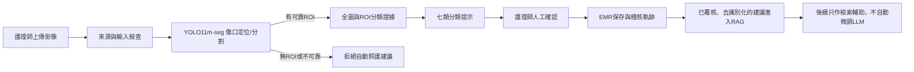

定位模型只回答「傷口在哪裡」，七類分類器回答「影像較像哪一類」。任何一段失敗都可能拖累端到端結果，所以本研究分別報告定位、裁切完整、分類與覆核，不把它們混成一個看似漂亮的Accuracy。

## 四、資料來源、數量與使用角色

### 4.1 本次核心資料

| 資料來源 | 上游連結與證據 | 本機／實驗數量 | 實際用途與隔離 |
|---|---|---:|---|
| 七類分類`Wound_dataset` | 舊流程稱Yasin；原始發布頁、下載版本、license仍未核實 | 原始431；平衡後train679、val41、locked test48 | 歷史分類研究。來源未補齊前不公開影像、不主張資料授權已驗證 |
| FUSeg | [官方repository](https://github.com/uwm-bigdata/wound-segmentation)，固定commit `42a272dfe0679f20675e826385925cb7562934b6`；[challenge PDF](https://github.com/uwm-bigdata/wound-segmentation/blob/42a272dfe0679f20675e826385925cb7562934b6/data/Foot%20Ulcer%20Segmentation%20Challenge/FootUlcerSegmentationChallenge2021.pdf)；[原始資料集論文](https://arxiv.org/abs/2201.00414) | 771 train、191 development val；另有官方test 200 | 最新YOLO11m-seg研究只用771/191；200 test只比對既存hash，像素未讀、使用0 |
| ISIC 2017 Task 1 | [官方資料頁](https://challenge.isic-archive.com/data/)、[training ZIP](https://isic-archive.s3.amazonaws.com/challenges/2017/ISIC-2017_Training_Data.zip) | 2,000 pairs，使用1,800 train／200 auxiliary val | 只作皮膚病灶輔助預訓練，不計入傷口模型效能分母；不是2,000張傷口 |
| CO2Wounds-V2 | [Mendeley Data](https://data.mendeley.com/datasets/s2w7rjwz49/1) | 607有標註，576內容群組；另157官方無標註test未用 | 2026-08-31一次跨來源測試；已看過後凍結，不再選模型或調參 |
| 場域／醫院影片 | 無公開URL；需保留原始IRB／consent／去識別化與抽幀血統 | bbox177＝130/40/7；polygon候選170＝130/40、220 polygons | 與公開資料隔離；命名可辨識抽幀家族，但不能代替授權與病人層級證據；本次未公開 |

FUSeg的PDF證據記載CC BY NC但未寫版本；本專案將用途限制為非商業學術報告。第十一節五張圖是FUSeg development案例，並提供SHA256與選圖理由；不是本研究場域資料。

### 4.2 歷史使用或完成篩選的來源

| 來源 | 連結 | 已核對數量與狀態 |
|---|---|---|
| AZH wound dataset | [UWM repository資料夾](https://github.com/uwm-bigdata/wound-segmentation/tree/master/data/wound_dataset)、[原論文](https://doi.org/10.1038/s41598-020-78799-w) | 官方train831 pairs；排除14後817，再排除1個3-pixel無法形成polygon案例，歷史實際816。不得把FUSeg條款自動外推到AZH |
| BUBT Lower Limb and Feet v2 | [Mendeley Data](https://data.mendeley.com/datasets/hsj38fwnvr/2) | healthy 2,757；歷史D-Seg-05選312、D-Seg-06另加108、D-Seg-08抽82；非病人獨立證據 |
| WSNet/WOUNDSEG | [Hugging Face dataset](https://huggingface.co/datasets/subbareddyoota/wseg_dataset)、[作者程式](https://github.com/subbareddy248/WSNET) | 2,686來源影像；本機官方分割1,894 train／412 val／380 test；資料卡CC BY-NC 4.0 |
| Kaggle舊彙整包 | [wound segmentation images](https://www.kaggle.com/datasets/leoscode/wound-segmentation-images) | 歷史配對FUSC1,186、Medetec374、WSNet1,176，共2,736列；是彙整列，不是三份新獨立資料 |
| Medetec | [原始影像頁](https://medetec.co.uk/files/medetec-images.html) | 舊彙整包內374列；本輪使用0，仍需核對衍生標註與使用條款 |
| Roboflow舊匯出 | project URL／version／license未找到 | 先前約180只是口述估計；本輪使用0，不寫成確定數字 |
| Redscar | [官方資料頁](https://redscar.uib.es/dataset.html) | 394張的候選紀錄；等待個別存取核准，使用0 |
| WoundsDB | [資料庫](https://chronicwounddatabase.eu/)、[Terms](https://chronicwounddatabase.eu/Terms) | 歷史候選188 records／79 visits／47 patients；未完成可靠取得，使用0 |
| WoundTissue | [GitHub](https://github.com/akabircs/WoundTissue) | 上游稱147，本機曾只核對13 pairs；使用0 |
| DFUTissueSegNet | [GitHub](https://github.com/uwm-bigdata/DFUTissueSegNet) | 上游稱110；license缺件，使用0 |
| SurgWound | [Hugging Face](https://huggingface.co/datasets/xuxuxuxuxu/SurgWound) | 上游686，未提供本研究需要的對應mask，使用0 |

「網站數量」「本機檔案數」「實際納入訓練數」分開記錄；資料夾裡有檔案不等於有合法來源、正確標註、獨立病人或可用於研究。

## 五、分類資料如何平衡、切分與隔離

### 5.1 原始與平衡後數量

| 類別 | 原始 | 初始train | 平衡後train | val | locked test |
|---|---:|---:|---:|---:|---:|
| Abrasions | 85 | 68 | 97 | 8 | 9 |
| Bruises | 122 | 97 | 97 | 12 | 13 |
| Burns | 59 | 47 | 97 | 5 | 7 |
| Cut | 50 | 40 | 97 | 5 | 5 |
| Ingrown_nails | 31 | 24 | 97 | 3 | 4 |
| Laceration | 61 | 48 | 97 | 6 | 7 |
| Stab_wound | 23 | 18 | 97 | 2 | 3 |
| 合計 | 431 | 342 | 679 | 41 | 48 |

平衡方式是把train內較少類別的既有檔案循序重複到每類97，不是增加新病人，也不是把val/test複製進train。679 train＋41 val形成720個開發檔案；48張locked test不進開發池。

### 5.2 為何720張只形成383個內容群組

MD5用來辨認位元完全相同的檔案。720個開發檔案形成383個exact-content groups：177個singleton，另206個duplicate groups涵蓋543檔；冗餘複本為543−206＝337，所以383＋337＝720。

早期一般五折讓178/206個重複群組跨越train/val，98.34%結果因此失效。修正後用GroupKFold讓同一內容群組只在同一fold。五個seed（42、123、3407、2026、999）各做五fold，共25個evaluation runs；它們共享同一開發池，不能稱25個獨立資料集。[StratifiedGroupKFold文件](https://scikit-learn.org/stable/modules/generated/sklearn.model_selection.StratifiedGroupKFold.html)是group不跨fold的實作依據。

MD5只能找完全相同檔案，重新壓縮、裁切、翻轉或同病人連拍不一定相同。更完整隔離還需要pHash、augmentation lineage、影片／病人ID；目前分類資料缺完整病人ID，所以不宣稱病人層級獨立。

### 5.3 修正後的分類結果

Phase B1只讀25個保存prediction arrays，不載入模型、不重跑48張test。每seed正好720列、五seed共3,600列：

| 指標 | 五seed pooled mean | seed sample SD | 範圍 |
|---|---:|---:|---:|
| Accuracy | 87.39% | 0.79 pp | 86.39–88.06% |
| Macro-F1 | 87.47% | 0.78 pp | 86.54–88.07% |
| Weighted-F1 | 87.43% | 0.79 pp | 86.52–88.04% |
| Stab_wound Recall | 91.92% | 4.52 pp | 89.90–100.00% |

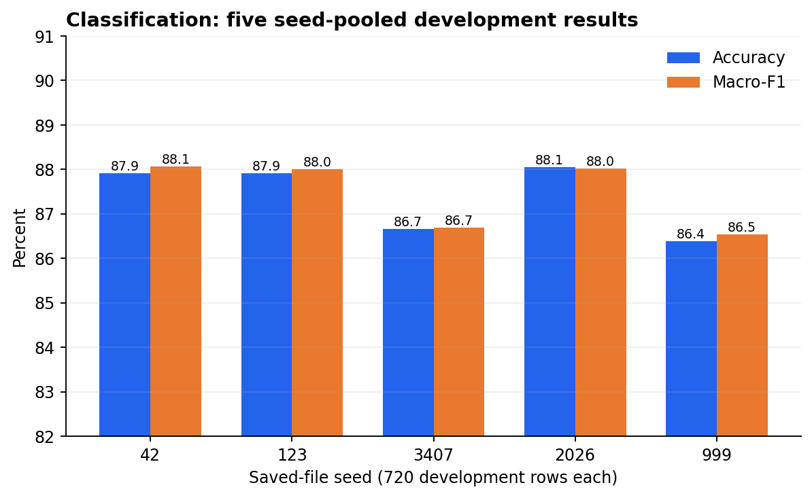

圖1：每個seed先合併五fold，再算一次指標；縱軸為82–91%，用於看小幅seed差異，不表示從0開始的絕對幅度。歷史25-fold mean Accuracy 87.40%與Macro-F1 87.36%可保留為次要描述，但不是25個獨立實驗。舊Stab_wound 88.98±9.30%來自欄位語義錯誤，已由保存陣列的91.92±4.52%取代。

舊Bootstrap把預測列當獨立抽樣單位，而且舊報告是3,622列。雖已重建3,600列，仍缺原ordered row→image／MD5 group身分，所以沒有製造新的grouped CI；B2維持BLOCKED。歷史48張一次性內部holdout為46/48＝95.83%，本輪未讀取、未重跑，也不當作外部臨床驗證。

## 六、YOLO11m-seg怎麼訓練與驗證

### 6.1 固定核心設定

| 項目 | 固定值 |
|---|---|
| 架構 | YOLO11m-seg，單類`Wound` |
| 主要資料 | FUSeg 771 train／191 development val |
| 初始化 | 同一ISIC auxiliary checkpoint |
| 訓練上限 | 300 epochs，patience80 |
| batch／optimizer | 4／AdamW |
| lr0／lrf | 0.0005／0.01，cosine schedule |
| warmup | 5 epochs，warmup_bias_lr=0 |
| 種子 | 42、123、3407、2026、999（依階段） |
| 訓練尺度 | control 768；higher-scale實驗1024 |
| 統一驗證與最終operational evaluation | nominal768；兩arm完全相同 |
| 幾何增強 | degrees5、translate.05、scale.2、shear.5、perspective.0002、fliplr.5 |
| 色彩增強 | hsv_h.01、hsv_s.4、hsv_v.25 |
| 組合增強 | mosaic.1、mixup0、copy_paste0；最後30 epochs關mosaic |

train影像參與梯度更新；development val只用於量測、選best checkpoint與研究決策。FUSeg official test200、分類locked48與CO2Wounds均不參與這些訓練／門檻比較。

### 6.2 固定operational evaluation

191張development val包含186張正樣本、5張來源負樣本、241個GT polygons。固定confidence0.10、prediction floor0.01、NMS IoU0.70、matching IoU0.50、imgsz768、ROI四邊margin15%。

- TP：預測框與尚未配對GT達IoU≥0.50。
- FP：沒有配對成功的保留預測。
- FN：沒有配對成功的GT。
- Crop complete：該正樣本ROI保留至少95% GT union-mask pixels；沒有ROI也算失敗。

mAP、固定工作點Precision/Recall、crop completeness回答不同問題，不能互相替代；單類分割指標也不是七類分類Accuracy。

## 七、這兩週實際完成的修正與實驗

### 7.1 A5／B1：先把分類證據修正乾淨

- 在訓練、評估、multi-seed、bootstrap與表格入口加入資料角色檢查；train入口拒絕test角色與覆寫既有run。
- 舊row-wise Bootstrap入口fail closed，避免再次輸出看似精確但抽樣單位錯誤的CI。
- 從保存陣列重建3,600列與七類混淆矩陣；不改舊檔、不重新推論。
- [分類結果封存](CLASSIFICATION_RESULT_FREEZE_20260920.md)、[B1報告](PHASE_B1_STATISTICAL_RECONSTRUCTION_REPORT_20260920.md)、[修正登錄](RESEARCH_CORRECTION_REGISTRY.md)保留每一項更正。

### 7.2 C：修正RGB/BGR後重新公平驗收

歷史錯誤是把PIL RGB轉成NumPy後直接傳入Ultralytics；官方介面中PIL預期RGB、NumPy預期BGR。受控重評估只改這個邊界，其餘checkpoint、191張資料、threshold、NMS、matching與crop全部固定。

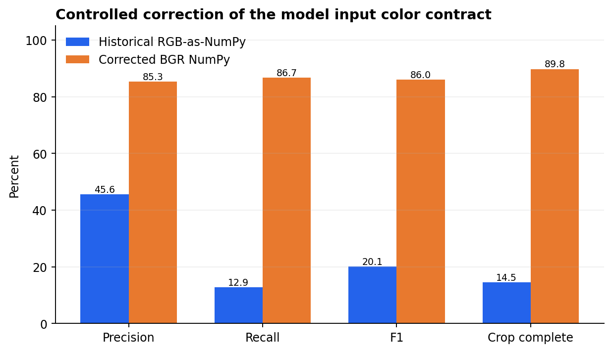

| 指標 | 錯誤RGB NumPy | 正確BGR NumPy | 差異 |
|---|---:|---:|---:|
| Precision | 45.59% | 85.31% | +39.72 pp |
| Recall | 12.86% | 86.72% | +73.86 pp |
| F1 | 20.06% | 86.01% | +65.94 pp |
| Crop complete | 14.52% | 89.78% | +75.27 pp |

修正後209 TP／36 FP／32 FN；Small Recall79.56%、Medium95.56%、Large100%。門檻要求Precision≥87.18與crop≥90.32%，因此仍FAIL。這說明評估錯誤解決後，真正剩下的是小傷口漏檢、多傷口crop與FP，不是繼續把錯誤低分歸咎模型。

### 7.3 D：小傷口加權抽樣的五seed確認

實驗組只改training anchor抽樣權重，其他架構、初始化、資料、epoch、loss與驗證完全相同。seed42的Small TP由104→108，通過單seed門檻；五seed結果如下：

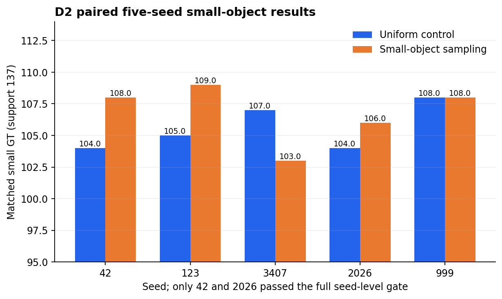

| Seed | Control Small TP | Sampling Small TP | 差異 | 完整seed gate |
|---:|---:|---:|---:|---|
| 42 | 104 | 108 | +4 | PASS |
| 123 | 105 | 109 | +4 | FAIL（其他安全指標未全過） |
| 3407 | 107 | 103 | −4 | FAIL |
| 2026 | 104 | 106 | +2 | PASS |
| 999 | 108 | 108 | 0 | FAIL |

五seed平均Small Recall只增加0.88pp，方向為正3/5，完整門檻2/5；very-small TP平均反而−0.6。結論是抽樣假說完成測試但未獲穩定確認，不製作V3救援結果。

### 7.4 E：Patch方案為何沒有硬做下去

E0發現49個very-small GT中存在跨十模型仍固定漏檢的難例，多傷口共現與弱定位明顯。Patch-based training是合理待驗假說，但E1對所有training targets做幾何稽核時發現polygon clipping／拓樸不符合strict contract；E1.1只有1/17問題來源找到exact raster-equivalent canonical representation，E1.2也未證明原生完整augmentation與mask-first adapter等價。

因此E1/E1.1/E1.2停在BLOCKED：不靜默`buffer(0)`、不刪polygon、不把近似raster當完全等價。這保護了標註語義，但也表示Patch訓練尚未獲准。

### 7.5 F：768與1024訓練尺度配對

原H4訓練只完成297/300 epochs，列為`INVALID_OR_INTERRUPTED`，沒有拿不完整模型比較。之後按預登錄規則從相同初始化重新跑H4-R 300 epochs；C4與H4-R均用相同771 train order、相同300×771 anchors、相同768 evaluation。C4 applied updates3,731／skipped10，H4-R3,732／skipped9，差異完整揭露且不補跑抵銷。

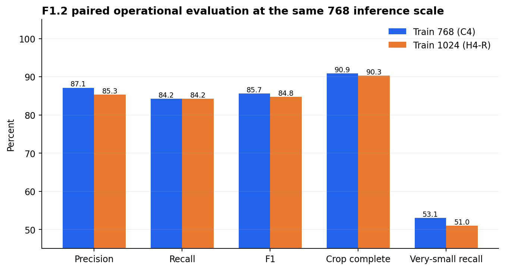

| 指標 | C4 train768 | H4-R train1024 | 方向 |
|---|---:|---:|---|
| Precision | 87.12% | 85.29% | −1.83 pp |
| Recall | 84.23% | 84.23% | 0 |
| F1 | 85.65% | 84.76% | −0.89 pp |
| Crop complete | 169/186＝90.86% | 168/186＝90.32% | −1 image |
| Very-small TP | 26/49 | 25/49 | −1 |
| Small TP | 104/137 | 102/137 | −2 |
| Medium／Large TP | 85/90／14/14 | 87/90／14/14 | +2／0 |
| FP | 30 | 35 | +5 |

研究門檻要求Very-small至少+2、Small最多−1、Precision／F1最多−1pp等條件全部同時通過；H4-R在very-small、small與Precision失敗。因此1024不是目前可採用改善，也沒有替換App。

### 7.6 F1.3：為什麼總TP一樣，錯誤卻不一樣

C4與H4-R各203 TP，但GT身分轉換為：共同偵測195、C4-only 8、H4-only 8、共同漏檢30。總數相同會隱藏「救回一部分、同時失去另一部分」。

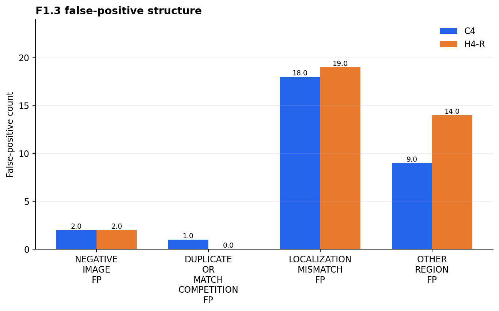

FP由30→35的主要來源是`OTHER_REGION_FP` 9→14；multi-GT影像FP由7→11。`OTHER_REGION`只表示與凍結GT bbox完全無交集，不等於已由醫護確認為正常組織，也可能是標註沒有涵蓋的區域。

8個C4→H4 loss中，6個有保留框但IoU不足；例如`fuseg__0604.png`的關鍵IoU為0.4999786，嚴格低於0.50。反向8個gain中，有4個在C4僅留下低於固定confidence的候選。這不授權調低threshold，因為降低threshold也會同時改變FP。

### 7.7 G0：可追溯負樣本不是「新資料」

771張FUSeg training重新核對為753 NONEMPTY、18 EMPTY、0 MISSING、0 INVALID。18張都能追溯到來源全零mask、18個唯一SHA256內容，與191 validation及既存200 test hashes沒有exact overlap；未讀test pixels，也沒有病人ID或近重複獨立性保證。

這18張在C4與H4-R原本每epoch各出現18次，300 epochs共5,400 anchor draws。因此G0只證明它們有可信「目前FUSeg wound target的negative」語義，不是臨床健康、不是18張新影像，也不能宣稱加入它們能解決FP。

## 八、目前問題、處理進度與完成標準

| 問題 | 已完成處理 | 尚未完成 | 完成標準 |
|---|---|---|---|
| 分類來源欠件 | 張數、分割與歷史用途已登錄 | 原始URL、版本、license、逐圖對應 | 能從原始發布證據追到431張，不以同名網站代替 |
| 舊分類統計錯誤 | 3,600列與seed-pooled結果已封存 | grouped CI | 恢復可信row→group身分，否則維持BLOCKED |
| RGB/BGR驗收錯誤 | 輸入契約與受控重評估完成 | 無 | 舊錯誤結果保留但不得再當有效比較 |
| Small／very-small漏檢 | C1、D2、E0、F1.3已量化 | 尚無跨seed穩定改善 | 固定資料與安全指標下，至少4/5 seeds同方向且全局安全條件通過 |
| Higher scale未改善 | 中斷模型排除、fresh replacement完成 | 不做事後救援 | 已判FAIL；新假說須另立protocol |
| FP增加 | 已定位OTHER_REGION與multi-GT結構 | G1尚未預登錄 | 只用train來源負樣本，Precision改善且very-small／crop不退化 |
| Patch標註拓樸 | fail-closed稽核完成 | 無可靠等價adapter | 每個來源instance在vector/raster/augmentation身份一致 |
| 外部泛化 | CO2一次結果已封存 | 新合法未見來源 | 來源、權利、patient/group isolation先通過，再一次評估 |
| App模型升級 | 既有安全與人工覆核保留 | 新模型未達門檻 | development gate＋獨立驗證＋部署安全驗收均通過 |

## 九、預計下一步

1. 建立G1預登錄，只回答「提高既有18張可信training negatives的監督曝光，能否降低FP且不傷害very-small Recall與crop safety」。先決定一個因素，不能同時改scale、loss、threshold與資料來源。
2. 固定回到train imgsz768作控制；1024失敗結果不與negative intervention合併救援。
3. 先做seed42配對：相同初始化、771 train、anchor order、300 epochs、更新機會與768 evaluation；記錄applied/skipped AMP updates。
4. Gate同時要求Precision／FP改善、Very-small與Small Recall不退化、Crop complete安全、Medium/Large不退化；不能靠全部少報框取得表面Precision。
5. 只有seed42過預定門檻才進五seed；五seed仍須方向一致與安全門檻。失敗就停止，不事後改threshold。
6. 在所有development決策完成前，不開FUSeg official test200、不重跑分類locked48、不重用CO2Wounds選模、不替換App。
7. 另行補分類原始來源與場域授權／去識別化證據；這是資料治理工作，不能用模型分數代替。

目前G1只是下一步計畫，不是已授權實驗，也沒有預告它會成功。

## 十、分析圖與傷口案例怎麼看

以下五張是F1.3保存的左右配對圖：左為C4（train768），右為H4-R（train1024），兩邊都以imgsz768做相同operational evaluation。綠框為GT、橘框為成功配對prediction、紅框為未配對prediction、青框為保存ROI。圖片已是既有分析產物，本次只做雜湊核對與公開副本，不重新推論。

## 十一、FUSeg公開案例圖庫

### 11.1 Higher-scale新增FP：`fuseg__0003.png`

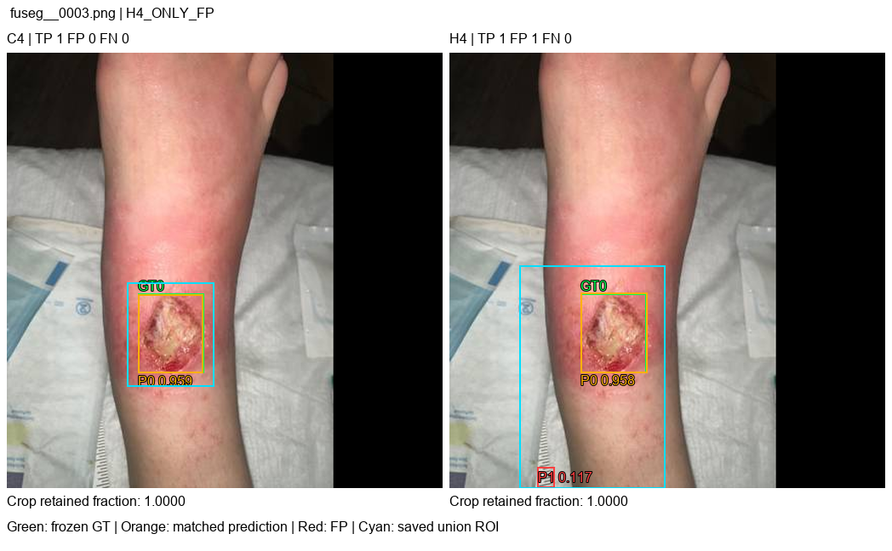

C4與H4-R都抓到主要傷口，但H4-R另多一個低信心未配對框。這是「提高尺度可能增加額外候選」的具體例子，不代表所有新增框都是正常皮膚。

### 11.2 偵測重新分配：`fuseg__0412.png`

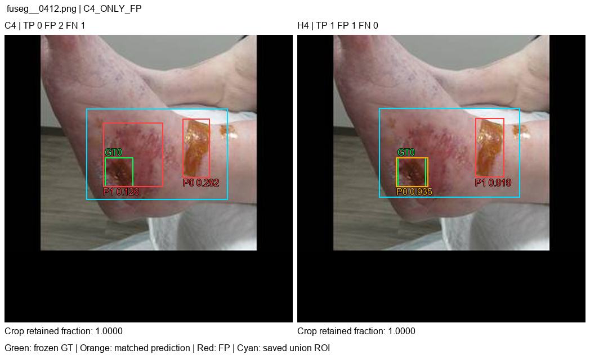

C4未匹配GT且產生兩個FP；H4-R成功匹配一個GT但仍有一個高信心未配對框。單看TP增加會忽略FP仍存在。

### 11.3 多傷口與0.50邊界：`fuseg__0604.png`

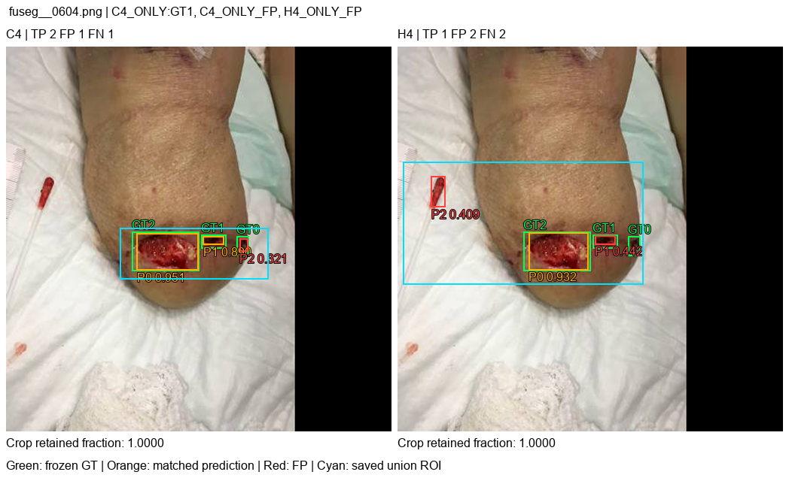

多GT案例中兩模型的框與錯誤分布不同；H4-R有一個候選IoU 0.4999786，按預先固定規則必須算未配對，不能四捨五入為0.50後改判。

### 11.4 Very-small退步：`fuseg__0867.png`

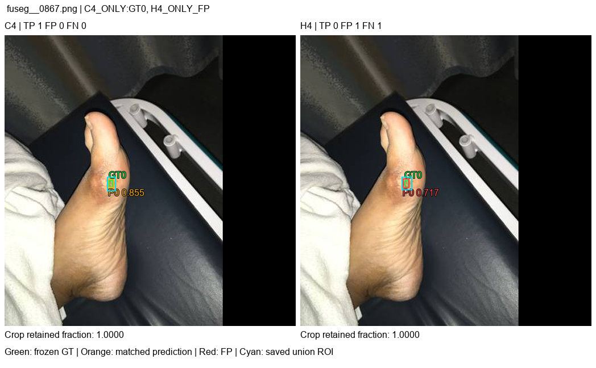

C4正確偵測很小的GT；H4-R雖有高信心框，但定位未達IoU門檻，形成C4-only TP。它說明高信心不等於定位正確。

### 11.5 多GT裁切改善：`fuseg__0971.png`

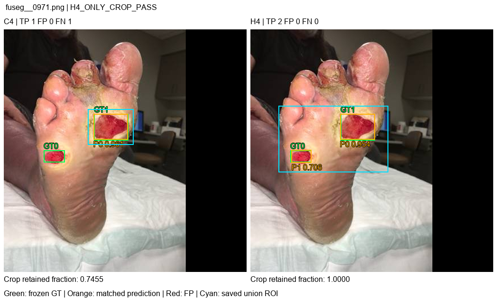

C4只匹配其中一個GT，裁切保留率0.7455；H4-R匹配兩個並把crop保留率提升到1.0。這是H4-R的真實局部改善，但不能抵銷整體very-small與FP門檻失敗。

五張圖的來源、理由與SHA256見[視覺manifest](report_assets/progress_20260929/manifest.json)。選圖是為解釋不同錯誤機制，不是隨機樣本，也不能用五張圖估計整體成功率。完整35張分析圖保留本機，避免把報告變成資料集批次再發布。

## 十二、本次程式與報告改動

- 新增資料角色合約：[data_roles.py](../experiments/data_roles.py)。
- 分類train/evaluate/multi-seed/statistics/table流程改為fail closed，禁止test角色進入train與舊row-wise CI再執行。
- 修正[ISIC→FUSeg gate](../experiments/review_v2/isic_fuseg_gate.py)的RGB→BGR輸入契約。
- 新增Phase A–G的稽核、配對runner、numerical telemetry、patch geometry、error analysis與相應tests。
- 對F1.1原中斷執行作唯讀鑑識；另跑新的H4 replacement，不把297 epochs結果偽裝完成。
- 修正E1.1 model-free runtime probe的測試隔離：probe在fresh spawned interpreters執行，父程序先前載入torch不再被誤判；worker內仍保留禁止模型import的fail-closed guard。
- 新增本報告、五張可重現分析圖、五張經檢視FUSeg案例與公開manifest；產生器為[build_progress_report_assets_20260929.py](../scripts/build_progress_report_assets_20260929.py)。

## 十三、驗證、安全與公開界線

本輪完整`unittest discover`在首次發佈檢查時找到1個測試順序隔離問題；最小重現證明先import torch會讓E1.1父程序guard誤報。修正後重新執行完整套件，**262項測試全部通過（43.827秒）**。這個數字是GitHub提交前的本機驗證結果；它證明目前自動測試未發現回歸，不等同臨床驗證或實際部署驗收。

公開內容只包含程式、設定、方法、聚合數字、FUSeg公開開發案例與SHA256。不得加入：本機密鑰、`.env`實值、資料庫、模型權重、場域影像、分類48張、FUSeg test200、CO2逐圖資料或完整資料集。

GitHub歷史曾有舊Fernet key事件；本機換key與分支重置已完成，但GitHub Support #4732924的伺服器舊物件清除不能因分支乾淨就視為完成。舊key永久視為已外洩。[GitHub官方敏感資料清除說明](https://docs.github.com/en/authentication/keeping-your-account-and-data-secure/removing-sensitive-data-from-a-repository)是處理邊界依據。

## 十四、為何使用這些方法、參考依據與本專案做法

這一節不是只列名詞，而是把每個決策的推理鏈寫完整：**遇到什麼問題 → 為何選這個方法 → 參考什麼資料 → 在本專案怎麼做 → 這個方法不能證明什麼**。外部文件提供一般方法或軟體介面的依據；本專案的數量、門檻與結果則必須由保存的manifest、預登錄文件和實驗輸出證明。

| 方法或決策 | 為何要使用 | 參考資料（可點連結） | 本專案實際做法與限制 |
|---|---|---|---|
| 只採用可追溯來源，並固定上游版本 | 同名資料可能被重新整理、改標或重新分割；只記網站名稱，日後無法證明實際使用哪一版。 | [FUSeg官方repository](https://github.com/uwm-bigdata/wound-segmentation)、[FUSeg原始論文](https://arxiv.org/abs/2201.00414)、[FUSeg challenge PDF](https://github.com/uwm-bigdata/wound-segmentation/blob/42a272dfe0679f20675e826385925cb7562934b6/data/Foot%20Ulcer%20Segmentation%20Challenge/FootUlcerSegmentationChallenge2021.pdf) | 核心分割資料固定到commit `42a272d...`，另保存檔案hash與771/191/200角色數量；公開報告只放5張經檢查的development例圖。七類分類來源因缺URL、版本與license而明確標`UNVERIFIED`，不把缺證據寫成已授權。 |
| 先固定train／validation／test角色 | 若看過test結果再選模型、調參或決定處理方式，test就不再代表未知資料。 | [scikit-learn：Data leakage](https://scikit-learn.org/stable/common_pitfalls.html#data-leakage)、[Cross-validation](https://scikit-learn.org/stable/modules/cross_validation.html) | 分類48張與FUSeg test200保持封存；開發只用train/validation。validation用來選擇方向，test只允許最後一次評估。這能降低選模洩漏，但不能保證資料與真實臨床場域完全同分布。 |
| 先切分，再只平衡training資料 | 類別不平衡會使模型更常看見多數類；重複抽樣可提高少數類在訓練中的出現頻率。但若先增生再切分，相同內容可能同時進入train與validation，造成虛高。 | [imbalanced-learn：RandomOverSampler](https://imbalanced-learn.org/stable/references/generated/imblearn.over_sampling.RandomOverSampler.html)、[scikit-learn：Data leakage](https://scikit-learn.org/stable/common_pitfalls.html#data-leakage) | 分類平衡只作用於每一fold的training portion，validation與test保留原始分布。平衡後的影像是重複或增強後的訓練曝露，不是新增病人、不是新增獨立病例，因此不能拿平衡後張數當獨立樣本數。 |
| 用內容hash找完全相同檔案 | 檔名不同不代表內容不同；若同一影像的複本跨到train與validation，模型可能只是在記憶圖片。 | [Python `hashlib`](https://docs.python.org/3/library/hashlib.html) | 歷史分類切分用MD5作exact-content grouping；公開資產與新封存證據用SHA-256核對。hash只證明位元內容是否相同，無法發現裁切、壓縮、旋轉後的近似重複，也不能代替病人ID。 |
| 用StratifiedGroupKFold而非一般隨機切分 | 要同時滿足「同一內容群組不得跨fold」與「七類比例盡量接近」；一般StratifiedKFold不保證群組隔離。 | [scikit-learn：StratifiedGroupKFold](https://scikit-learn.org/stable/modules/generated/sklearn.model_selection.StratifiedGroupKFold.html) | 720張development影像先形成383個MD5 groups，再以group為不可拆單位分成5 folds。每次4 folds訓練、1 fold驗證，循環5次。各fold只能盡量平衡，因群組大小與類別組合不同，不可能保證張數完全相等。 |
| 5 folds × 5 seeds | 5-fold讓每個development group都有一次作validation，較單次切分能看見切分敏感性；多seed則檢查初始化、資料順序等隨機因素是否改變結論。 | [scikit-learn：Cross-validation](https://scikit-learn.org/stable/modules/cross_validation.html)、[PyTorch：Reproducibility](https://docs.pytorch.org/docs/stable/notes/randomness.html) | 使用5個固定seed，每個seed跑5 folds，共25次評估。這是25個leakage-free evaluation runs，**不是25個獨立資料集**；相同development pool會重複出現在不同run，所以不能把25次直接當完全獨立樣本。 |
| 從保存的逐圖預測重建分類統計 | 只看彙總CSV無法追查列數、重複列或預測來源；逐圖列才可核對真值、預測與seed。 | [Phase B1重建報告](PHASE_B1_STATISTICAL_RECONSTRUCTION_REPORT_20260920.md)、[Phase B2阻塞說明](PHASE_B2_BLOCKER.md) | B1只使用已保存的3,600列（720×5 seeds）重建seed-level結果，並撤回舊3,622列敘述。因缺少可靠row→image/group identity，group-aware bootstrap維持BLOCKED；不能為了得到CI而猜測群組。 |
| Bootstrap信賴區間必須保留抽樣單位 | Bootstrap用有放回重抽樣估計統計量的不確定性；但若資料有群組依賴，逐列亂抽會把相依樣本錯當獨立。 | [SciPy：`stats.bootstrap`](https://docs.scipy.org/doc/scipy/reference/generated/scipy.stats.bootstrap.html) | 舊row-wise CI保留為歷史資料但禁止再當正式group-aware CI。只有補齊可驗證的image/group identity後才可依群組重抽樣；目前「不報正式CI」比產生不可辯護的精確數字更嚴謹。 |
| YOLO11m-seg作傷口定位與裁切 | 系統真正需要的是先找到傷口範圍，再把有意義的ROI交給七類分類器；segmentation polygon比單一bbox更能描述不規則傷口輪廓。 | [Ultralytics：YOLO11](https://docs.ultralytics.com/models/yolo11/)、[Segmentation dataset format](https://docs.ultralytics.com/datasets/segment/)、[Train mode](https://docs.ultralytics.com/modes/train/) | 偵測／分割階段只學單類`Wound`，不要求它判七種傷口；七類判斷仍由分類模型負責。此設計降低任務衝突，但整體系統仍受第一階段漏檢與裁切錯誤影響。 |
| 遷移學習，而非從零開始 | 醫療影像資料量有限；預訓練權重可提供低階視覺特徵與較穩定的起點。 | [PyTorch：Transfer Learning tutorial](https://docs.pytorch.org/tutorials/beginner/transfer_learning_tutorial.html) | ISIC只作auxiliary pretraining／warm start，真正傷口表現仍由FUSeg validation衡量。皮膚病灶與傷口存在domain gap，因此ISIC表現不能直接宣稱為傷口定位能力。 |
| 所有影像輸入明確區分RGB與BGR | PIL通常提供RGB，OpenCV/NumPy流程常是BGR；通道順序錯誤不一定報錯，卻會讓模型看到錯色影像。 | [Ultralytics：Inference sources](https://docs.ultralytics.com/modes/predict/#inference-sources) | Phase C固定同一checkpoint、同一191張validation與同一門檻，只修正輸入契約；F1由20.06%恢復到86.01%。這證明舊低分主要受色彩通道缺陷影響，不等於模型已通過全部驗收門檻。 |
| 同時報mAP與固定工作點Precision／Recall／F1 | mAP整合多個confidence/IoU條件，適合比較排序能力；實際裁切系統仍需要在一個固定工作點知道TP、FP、FN與裁切保留率。 | [Ultralytics：Validation mode](https://docs.ultralytics.com/modes/val/)、[COCO evaluation implementation](https://github.com/cocodataset/cocoapi/blob/master/PythonAPI/pycocotools/cocoeval.py) | 標準mAP與專案工作點分開報告。專案的`conf=0.1`、`IoU=0.5`、crop-retention門檻屬於內部預登錄驗收規格，不是COCO或Ultralytics宣稱的臨床最佳值；固定後不得看結果再改。 |
| 控制變因的配對實驗 | 若模型、資料、seed、epoch和解析度一起改，成績變化無法歸因。配對設計讓control與experimental只差一個預先指定因素。 | [D2預登錄](PHASE_D2_PREREGISTRATION_20260923.md)、[F0解析度預登錄](PHASE_F0_HIGHER_INPUT_SCALE_PREREGISTRATION_20260925.md)、[F0.2修訂協定](PHASE_F02_HIGHER_SCALE_V2_PROTOCOL_REVISION_20260926.md) | 小傷口抽樣比較同seed的Control與Sampling；解析度比較凍結C4與新的H4-R。保存不利seed並使用預先固定gate，避免只挑最好結果。這是專案內部實驗控制，不代表已完成隨機臨床試驗。 |
| 多seed確認，而非以seed 42單次成功下結論 | 單一seed可能剛好有利；方向若不能跨seed重現，就不適合升級成預設方案。 | [PyTorch：Reproducibility](https://docs.pytorch.org/docs/stable/notes/randomness.html)、[D2五seed報告](PHASE_D2_MULTI_SEED_SMALL_SAMPLING_CONFIRMATION_20260923.md) | D2保留42、123、3407、2026、999全部結果，以至少4/5方向一致及完整gate作判斷；實際只有2/5通過完整gate，因此結論是FAIL而不是挑seed 42報成功。 |
| 針對very-small做分層錯誤分析 | 總體指標可能掩蓋小傷口失敗；先依GT尺寸分層，才能知道問題是漏檢、定位或假陽性。 | [Phase E0錯誤稽核](PHASE_E0_VERY_SMALL_FAILURE_AUDIT_20260925.md)、[SAHI原始論文](https://arxiv.org/abs/2202.06934) | 本專案先用E0確認very-small為主要瓶頸，再測sampling與較高輸入尺寸。SAHI文獻只支持「小物件需專門處理」的研究動機；本專案沒有宣稱已重現SAHI方法或結果。 |
| 高解析度1024必須與768成對比較 | 提高輸入尺寸理論上可能保留小傷口像素，但也可能增加背景反應、記憶體負擔與FP；不能只假設越大越好。 | [Ultralytics：Train mode的`imgsz`參數](https://docs.ultralytics.com/modes/train/)、[F1.2恢復與比較報告](PHASE_F12_H4_REPLACEMENT_RECOVERY_20260928.md) | C4與H4-R在相同validation與固定門檻下比較。H4-R總TP未增加、very-small TP少1、FP多5，因此未通過gate。這個結果只適用於目前資料、模型與設定，不能推論所有高解析度方法都無效。 |
| 用逐圖配對視覺化解釋「分數為何變動」 | 單一mAP或F1只告訴好壞，不能回答哪張圖由對變錯、FP出現在哪裡、裁切是否保留完整。 | [Phase F1.3配對錯誤稽核](PHASE_F13_PAIRED_PREDICTION_ERROR_AUDIT_20260929.md)、[本報告視覺manifest](report_assets/progress_20260929/manifest.json) | 逐GT分成BOTH、C4_ONLY、H4_ONLY、BOTH_MISSED，FP再分負片、重複框、定位失敗與其他區域；五張公開FUSeg例圖只用來解釋機制，不能由五張圖估計成功率。 |
| 負樣本先做來源稽核，再決定是否新增實驗 | 為抑制FP而加入負片是合理假設，但若把validation失敗圖回灌training，就會污染驗證；若原本已訓練過，也不能稱為新增資料。 | [Phase G0負樣本來源稽核](PHASE_G0_CONFIRMED_NEGATIVE_SOURCE_AUDIT_20260929.md)、[FUSeg repository](https://github.com/uwm-bigdata/wound-segmentation) | 找到18張training split內原生全零mask，且與validation與鎖定test hash零重疊；但它們已在每個epoch出現，所以只能作「重加權／hard-negative exposure」候選，不能宣稱加入18張新資料。它們是FUSeg任務定義下的negative，不等同臨床健康皮膚。 |
| 幾何／標註衝突採fail closed | polygon拓撲若有歧義，靜默修補會改變ground truth，之後即使成績提升也不知道是模型改善還是標註被改寫。 | [E1 patch預登錄](PHASE_E1_PATCH_TRAINING_PREREGISTRATION_20260925.md)、[E1.1 topology/raster協定](PHASE_E11_TOPOLOGY_RASTER_PREREGISTRATION_20260925.md)、[E1.2 mask-first可行性](PHASE_E12_MASK_FIRST_FEASIBILITY_20260925.md) | canonical decision證據不足時停止，不自行猜polygon順序；E1.1與E1.2維持BLOCKED。這犧牲速度，但保留ground-truth可追溯性。 |
| RAG只吸收人工覆核後的處置知識 | 護理長建議需要可追溯與可撤回；直接把每次輸出拿去自動微調，會把未確認內容永久放大。 | [Lewis等：Retrieval-Augmented Generation](https://arxiv.org/abs/2005.11401) | 只把有來源、版本、覆核者與時間戳的建議放入可檢索知識庫；模型輸出仍是決策支援，不取代護理師判斷。目前本報告記錄的是設計原則，不宣稱已完成臨床效益驗證。 |

### 14.1 如何理解「參考資料」的證據強度

1. **官方軟體文件**（scikit-learn、PyTorch、Ultralytics、Python、SciPy）用來確認介面定義、資料格式與常見風險。
2. **原始論文**（FUSeg、SAHI、RAG）用來說明研究動機與方法背景，不直接替本專案的結果背書。
3. **本專案預登錄與manifest**才決定本次實驗的資料、seed、門檻、成敗條件與能否重跑。
4. **本專案保存結果與配對證據**才回答「這個方法在目前資料上是否有效」。文獻說可能有效，不代表本專案就能宣稱成功。
5. 本報告是回溯整合；沒有證據證明的地方明確標為BLOCKED、FAIL或尚未開始，不冒稱所有歷史實驗都事前完成預註冊。

> 我先重新核對分類與分割的資料角色、預測列和程式輸入，發現分類舊統計多了22列，分割驗收則有RGB/BGR通道錯誤。修正後分類以3,600個保存預測列重建，五seed的Accuracy為87.39±0.79個百分點；分割F1由錯誤輸入下的20.06%恢復到86.01%，但仍未通過Precision與裁切完整率門檻。接著我用五seed測試小傷口加權抽樣，只有2/5通過完整安全門檻；再做768與1024配對，1024沒有增加總TP，反而very-small少1個、FP多5個。配對錯誤稽核顯示問題主要是偵測重新分配與其他區域FP增加。目前已找到18張有原始全零mask的可信training negatives，但它們原本已參與每輪訓練，因此下一步必須先預登錄一個真正單一因素的假陽性控制實驗，而不是直接宣布加入負樣本就會改善。整個過程未重開分類48張、未讀FUSeg test pixels、未重用CO2選模，也未替換App模型。
